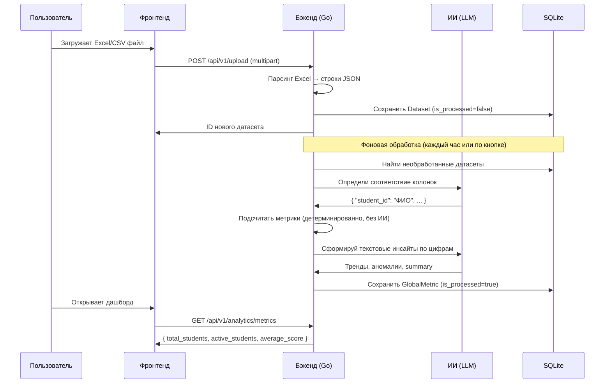

# ZVKR — Система ИИ-аналитики контингента образовательного учреждения

> **Для членов комиссии:** Это автоматически создаваемая аналитическая платформа. Вы загружаете таблицу Excel или CSV — система сама разбирается в структуре данных с помощью искусственного интеллекта, считает показатели (контингент, успеваемость, активные студенты) и отвечает на вопросы на естественном языке.

---

## Содержание

1. [О проекте](#часть-1-о-проекте)
2. [Быстрый старт (запуск exe-файла)](#часть-2-быстрый-старт-из-скомпилированных-релизов)
3. [Сборка из исходников](#часть-3-сборка-из-исходников-для-разработчиков)

---

## Часть 1: О проекте

### Что делает проект

**ZVKR** — это веб-приложение для аналитики данных о студентах университета. Оно получает файлы Excel или CSV с информацией о контингенте (кто учится, кто отчислен, какой средний балл) и автоматически строит дашборд с ключевыми показателями.

Главная особенность: **система не требует заранее известного формата таблиц**. Если в одном файле колонка называется «ФИО», а в другом — «StudentName», искусственный интеллект сам определит, что это одно и то же, и правильно обработает данные.

Пользователь может задавать вопросы в свободной форме: «Сколько студентов отчислилось в 2022 году?», «Покажи динамику успеваемости по годам» — и получать ответы в виде текста и графиков.

### Какую задачу решает

Отделы деканата и аналитики часто получают данные из разных систем (1С, Moodle, ручные выгрузки) в разных форматах. Ручная обработка занимает дни. ZVKR автоматизирует этот процесс: загрузил файл — получил аналитику за секунды.

### Используемые технологии

| Слой | Технология | Назначение |
|------|-----------|------------|
| Язык бэкенда | Go 1.25 | Быстрый, надёжный серверный язык |
| Веб-фреймворк | Fiber v2 | HTTP-сервер и REST API |
| Основная база данных | SQLite (через GORM) | Хранение пользователей, датасетов, настроек |
| Кэш-база | BoltDB | Быстрое хранение новостей и кэша дашборда |
| Фронтенд | Preact + TypeScript | Интерфейс пользователя (аналог React) |
| Сборщик фронтенда | Vite + Bun | Компиляция TypeScript в JavaScript |
| Стили | TailwindCSS v4 | Тёмная тема, адаптивный дизайн |
| Графики | Recharts, Chart.js | Визуализация данных |
| ИИ-провайдеры | OpenRouter, Ollama, YandexGPT, GigaChat | Языковые модели для анализа |
| Python-песочница | Wazero (WebAssembly) | Безопасное выполнение Python-кода |
| Аутентификация | JWT (HS256) | Токены авторизации |
| Планировщик | robfig/cron | Фоновые задачи по расписанию |

### Архитектура: клиент-сервер

Приложение состоит из двух частей, объединённых в **один исполняемый файл**:

- **Бэкенд (Go)** — сервер, который обрабатывает данные, обращается к ИИ, хранит всё в базе данных.
- **Фронтенд (Preact)** — интерфейс браузера, встроенный прямо в исполняемый файл как статические файлы.

```
Браузер пользователя
       │  HTTP запросы
       ▼
┌─────────────────────────────┐
│        zvkr.exe             │
│                             │
│  ┌───────────────────────┐  │
│  │  Fiber (HTTP-сервер)  │  │
│  └──────────┬────────────┘  │
│             │               │
│  ┌──────────▼────────────┐  │
│  │   Обработчики (API)   │  │
│  └──────┬────────────────┘  │
│         │                   │
│  ┌──────▼────────────────┐  │
│  │   Сервисы / Бизнес-   │  │
│  │       логика          │  │
│  └──┬──────┬──────┬──────┘  │
│     │      │      │         │
│  SQLite  BoltDB  ИИ-API     │
│  (doctor.db) (cache.db)     │
└─────────────────────────────┘
```

### Поток данных (жизнь одного файла)



---

## Часть 2: Быстрый старт (из скомпилированных релизов)

### Шаг 1: Скачать файл

Перейдите в раздел **Releases** репозитория на GitHub. Скачайте файл для вашей операционной системы:

- **Windows**: `zvkr-windows-amd64.exe`
- **Linux**: `zvkr-linux-amd64`

> Никаких дополнительных файлов устанавливать не нужно — Go-приложение полностью автономно.

### Шаг 2: Разместить файл

Создайте отдельную папку (например, `C:\ZVKR\`) и положите туда скачанный файл.

### Шаг 3: Запустить

**На Windows:** дважды кликните по `zvkr-windows-amd64.exe`.

Или через командную строку:
```
zvkr-windows-amd64.exe
```

**На Linux:**
```bash
chmod +x zvkr-linux-amd64
./zvkr-linux-amd64
```

### Шаг 4: Первый запуск — настройка администратора

При первом запуске приложение:
1. Автоматически создаёт базу данных `doctor.db` в той же папке.
2. Генерирует случайный пароль для администратора.
3. Открывает браузер на странице **http://localhost:6331/setup**.

На странице настройки вы увидите логин (`admin`) и сгенерированный пароль. Нажмите «Завершить настройку» — пароль будет стёрт из памяти для безопасности.

### Шаг 5: Войти и загрузить данные

1. Войдите с учётными данными `admin` / (ваш пароль).
2. Перейдите в раздел **«Загрузить»** и загрузите файл CSV или Excel.
3. Нажмите кнопку **«Синхронизация»** на дашборде — ИИ обработает данные.

### Как открыть в браузере

По умолчанию приложение запускается на порту **6331**. Если браузер не открылся автоматически, откройте вручную:

```
http://localhost:6331
```

### Переменные окружения (опционально)

Создайте файл `.env` в папке с программой, чтобы настроить поведение без перезапуска:

```env
PORT=6331
DB_PATH=doctor.db
JWT_SECRET=замените-на-свой-секрет
LLM_PROVIDER=openrouter
OPENROUTER_API_KEY=ваш-ключ
OPENROUTER_MODEL=google/gemma-3-27b-it
```

Настройки также можно изменить через интерфейс: раздел **«Настройки»** (только для администратора).

### Частые ошибки и их решения

| Ошибка | Причина | Решение |
|--------|---------|---------|
| Браузер не открывается | Порт 6331 занят другим приложением | Задайте `PORT=другой_порт` в `.env` |
| «Новости еще загружаются» | Сервер только запустился | Подождите 30 секунд и обновите страницу |
| Кнопка «Синхронизация» неактивна | Все датасеты уже обработаны | Это нормально — данные актуальны |
| ИИ не отвечает | Не настроен API-ключ провайдера | Зайдите в «Настройки» → выберите провайдера → введите ключ |
| «Failed after 3 attempts» | ИИ генерирует некорректный Python-код | Переформулируйте вопрос или переключитесь на «Текстовый режим» |

---

## Часть 3: Сборка из исходников (для разработчиков)

### Требования

| Инструмент | Версия | Проверка |
|-----------|--------|---------|
| Go | 1.25+ | `go version` |
| Bun | последняя | `bun --version` |
| Make | любая | `make --version` |

### Клонирование репозитория

```bash
git clone <URL репозитория>
cd ZVKR-main
```

### Установка зависимостей

```bash
# Go зависимости
go mod download

# Node зависимости фронтенда
cd frontend && bun install && cd ..
```

### Сборка (полная — фронтенд + бэкенд)

```bash
make build
```

Это выполнит последовательно:
1. `bun install` + `vite build` — компиляция фронтенда в `frontend/dist/`
2. Копирование `frontend/dist/` → `internal/routes/dist/`
3. `go build` — компиляция единого исполняемого файла в `build/zvkr`

### Запуск в режиме разработки (hot reload)

Используется [Air](https://github.com/air-verse/air) — инструмент для автоматической перекомпиляции при изменении Go-файлов:

```bash
# Установить Air (один раз)
go install github.com/air-verse/air@latest

# Запустить
air
```

Air следит за папками `cmd/` и `internal/` и автоматически пересобирает бэкенд при изменении `.go` файлов. Флаг `-no-browser` предотвращает многократное открытие вкладок браузера.

### Структура проекта

```
ZVKR-main/
│
├── cmd/gate/main.go           # Точка входа: запуск сервера, инициализация сервисов
│
├── internal/
│   ├── config/config.go       # Конфигурация из .env и базы данных
│   ├── database/connect.go    # Подключение к SQLite через GORM
│   ├── handlers/              # Обработчики HTTP-запросов (auth, dataset, analytics, export, settings)
│   ├── middleware/             # Проверка JWT-токена и ролей
│   ├── models/                # Модели таблиц базы данных (GORM)
│   ├── routes/routes.go       # Регистрация всех API-маршрутов + встроенный фронтенд
│   ├── integrations/news.go   # Парсер RSS-новостей (Минпросвещения)
│   └── services/
│       ├── ai_pipeline.go     # ИИ-конвейер: Code Interpreter + Map-Reduce
│       ├── analytics/         # Детерминированный подсчёт метрик + LLM-инсайты
│       ├── auth/jwt.go        # Хэширование паролей (bcrypt) и JWT
│       ├── email/imap.go      # Получение Excel-файлов из почты (IMAP)
│       ├── emulator/          # Генератор тестовых данных
│       ├── erp/erp.go         # Интеграция с внешней БД (Postgres/MySQL/MSSQL)
│       ├── excel/parser.go    # Парсинг Excel и CSV файлов
│       ├── export/            # Экспорт данных в Excel и PDF
│       ├── llm/               # Интерфейс LLM + реализации (OpenRouter, Ollama, Yandex, GigaChat)
│       ├── moodle/moodle.go   # Интеграция с системой Moodle
│       ├── sandbox/           # Python-песочница на Wazero (WebAssembly)
│       └── scheduler/cron.go  # Планировщик фоновых задач (cron)
│
├── frontend/
│   ├── src/
│   │   ├── api/client.ts      # HTTP-клиент с JWT авторизацией
│   │   ├── components/        # Переиспользуемые компоненты (чат, таблица, графики)
│   │   ├── pages/             # Страницы приложения (дашборд, аналитика, настройки)
│   │   └── types/index.ts     # TypeScript-интерфейсы
│   └── package.json           # Node зависимости
│
├── datasets/                  # Тестовые CSV-датасеты студентов (2016-2030)
├── dataset_2016_2020/         # Копия датасета 2016-2020
├── dataset_2020_2024/         # Копия датасета 2020-2024
├── dataset_2025_2030/         # Копия датасета 2025-2030
│
├── scripts/generate_uni_data.py  # Python-скрипт для генерации тестовых датасетов
├── Makefile                   # Команды сборки
├── .air.toml                  # Конфигурация hot reload (Air)
├── go.mod                     # Go зависимости
└── .github/workflows/build.yml   # CI/CD: автосборка и публикация релизов
```

### CI/CD: автоматические релизы

При каждом push в ветку `main` GitHub Actions автоматически:
1. Собирает фронтенд (Bun + Vite).
2. Компилирует бэкенд для Linux (AMD64) и Windows (AMD64) — без CGO, статически.
3. Публикует бинарные файлы в раздел **Releases** как dev-build.

При создании тега вида `v1.0.0` выпускается полноценный (не pre-release) релиз.
