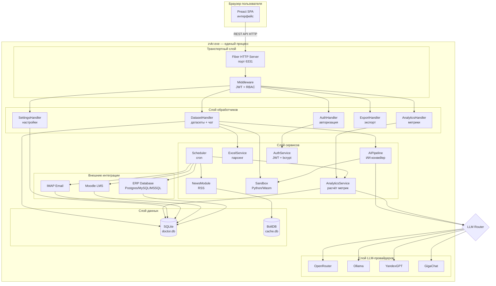
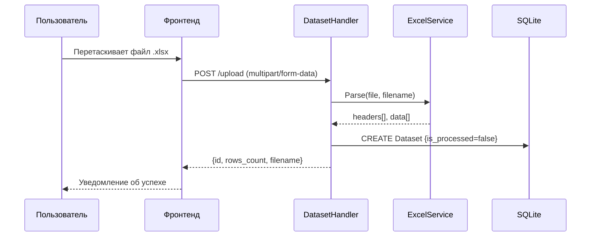
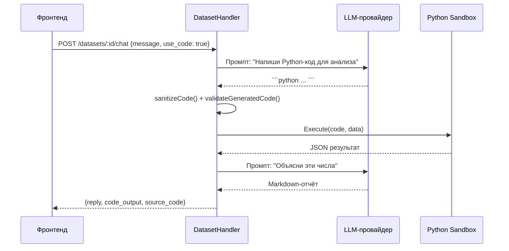

# Архитектура системы ZVKR

## Содержание

- [Общий обзор](#общий-обзор)
- [Диаграмма компонентов](#диаграмма-компонентов)
- [Слои приложения](#слои-приложения)
- [Взаимодействие фронтенда с бэкендом](#взаимодействие-фронтенда-с-бэкендом)
- [Потоки данных](#потоки-данных)
- [Безопасность](#безопасность)

---

## Общий обзор

ZVKR — монолитное приложение с архитектурой **клиент-сервер**, упакованное в **один исполняемый файл**. Это значит, что весь пользовательский интерфейс (HTML, CSS, JavaScript) встроен прямо внутрь Go-бинарника с помощью механизма `embed.FS`. Пользователю не нужно отдельно устанавливать веб-сервер или фронтенд.

Внешний вид с точки зрения пользователя:
- Запускает один файл `zvkr.exe`.
- Открывает браузер на `http://localhost:6331`.
- Работает как обычный веб-сайт.

---

## Диаграмма компонентов



---

## Слои приложения

### 1. Транспортный слой (HTTP)

**Файл:** `internal/routes/routes.go`

Точка входа для всех HTTP-запросов. Использует фреймворк **Fiber** (аналог Express.js для Go).

Отвечает за:
- Регистрацию всех маршрутов API (`/api/v1/...`).
- Раздачу статических файлов фронтенда.
- SPA-fallback (любой неизвестный URL возвращает `index.html`, чтобы маршрутизация Preact работала).
- Автоматическое открытие браузера при старте.

Слой middleware (`internal/middleware/`) проверяет JWT-токен и роль пользователя **до** попадания запроса в обработчик.

### 2. Слой обработчиков (Handlers)

**Папка:** `internal/handlers/`

Обработчики принимают HTTP-запрос, извлекают параметры и вызывают нужный сервис. Они не содержат бизнес-логики — только «оркестрация»:

| Обработчик | Файл | Ответственность |
|-----------|------|----------------|
| `AuthHandler` | `auth.go` | Вход, регистрация, управление пользователями |
| `DatasetHandler` | `dataset.go` | Загрузка файлов, просмотр, чат с ИИ |
| `AnalyticsHandler` | `analytics.go` | Получение метрик, запуск синхронизации |
| `ExportHandler` | `export.go` | Экспорт в Excel и PDF |
| `SettingsHandler` | `settings.go` | Чтение и обновление системных настроек |

### 3. Слой сервисов (Services)

**Папка:** `internal/services/`

Содержит бизнес-логику. Каждый сервис — независимый модуль:

| Сервис | Файл | Что делает |
|--------|------|-----------|
| `AIPipeline` | `ai_pipeline.go` | Два режима ИИ-анализа: Code Interpreter и Map-Reduce |
| `AnalyticsService` | `analytics/metrics.go` | Маппинг колонок через LLM, детерминированный подсчёт |
| `ExcelService` | `excel/parser.go` | Парсинг .xlsx, .xls, .csv файлов |
| `WasmRunner` | `sandbox/wazero.go` | Выполнение Python внутри WebAssembly |
| `AuthService` | `auth/jwt.go` | bcrypt-хэширование паролей, генерация JWT |
| `IMAPService` | `email/imap.go` | Чтение писем и вложений Excel по почте |
| `MoodleService` | `moodle/moodle.go` | Загрузка данных о курсах из Moodle |
| `ERPService` | `erp/erp.go` | Снапшоты из внешней БД университета |
| `EmulatorService` | `emulator/emulator.go` | Генерация тестовых данных |
| `OfficialNewsModule` | `integrations/news.go` | RSS-парсинг новостей Минпросвещения |
| `Scheduler` | `scheduler/cron.go` | Запуск сервисов по расписанию (cron) |

### 4. Слой данных (Models + Database)

**Папки:** `internal/models/`, `internal/database/`

- **SQLite** (`doctor.db`) — основная база данных. Хранит пользователей, датасеты, чат, настройки, глобальные метрики.
- **BoltDB** (`cache.db`) — ключ-значение хранилище для кэша новостей. Позволяет мгновенно отдавать новости без повторного парсинга RSS.

---

## Взаимодействие фронтенда с бэкендом

### Протокол

Фронтенд общается с бэкендом исключительно через **REST API** (HTTP + JSON). Все эндпоинты начинаются с `/api/v1`.

WebSocket не используется. Обновление данных в реальном времени реализовано через **polling** — фронтенд сам опрашивает сервер каждые 15 секунд.

### Авторизация

```
Клиент                          Сервер
  │                               │
  │── POST /api/v1/login ────────>│
  │   { username, password }      │
  │                               │ Проверяет bcrypt-хэш
  │<── { token, role } ──────────│
  │                               │
  │── GET /api/v1/datasets ──────>│
  │   Authorization: Bearer <JWT> │
  │                               │ Проверяет подпись JWT
  │<── [{ id, name, ... }] ──────│
```

JWT-токен хранится в `localStorage` браузера и живёт **72 часа** (3 дня). При истечении или ошибке 401 — автоматический редирект на страницу входа.

### Базовый URL API

```typescript
const API_BASE = "/api/v1";
// Пример вызова:
const res = await fetch("/api/v1/datasets", {
  headers: { "Authorization": `Bearer ${localStorage.getItem("token")}` }
});
```

---

## Потоки данных

### Загрузка и обработка файла



### ИИ-анализ (Code Interpreter)



---

## Безопасность

### Аутентификация и авторизация

- Пароли хранятся как **bcrypt-хэш** (cost=14) — восстановить невозможно.
- JWT подписывается алгоритмом **HS256** секретным ключом из конфига.
- Три роли: `admin` (полный доступ), `analyst` (загрузка + аналитика), `user` (только чтение).

### Изоляция Python-кода

Python-скрипты, генерируемые ИИ, выполняются внутри **WebAssembly-рантайма Wazero** со следующими ограничениями:
- Нет доступа к файловой системе.
- Нет сетевого доступа.
- Лимит памяти: 128 МБ.
- Таймаут: 20 секунд.
- Запрещены импорты: `pandas`, `numpy`, функция `open()`.

Перед выполнением в код автоматически **вставляется охранный блок** (sandbox guard), который проверяет, что переменная `dataset` не была переопределена скриптом.

### Защита чувствительных данных

- API-ключи и пароли скрываются масками (`********`) при возврате на фронтенд.
- Поле `PasswordHash` модели `User` помечено тегом `json:"-"` — никогда не попадает в JSON-ответы.
